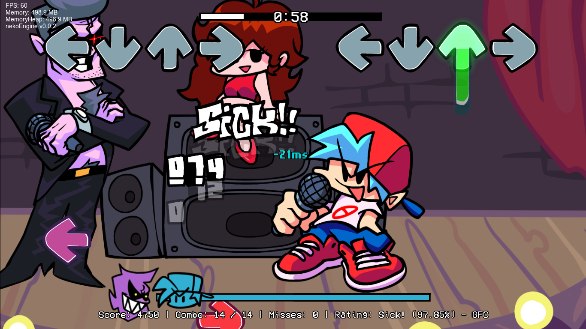
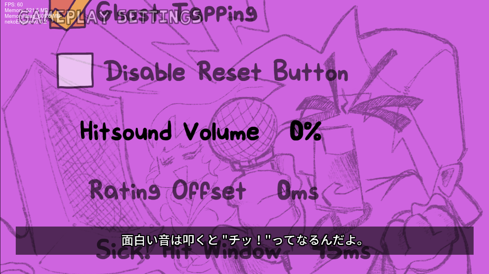

[日本語版](README_ja-jp.md)  

Note: This document uses the DeepL translation and the text may be incorrect.  
If you have any questions, please contact Issues.  
  
[Psych Engine Docs](PsychEngine.md)
# Friday Night Funkin' - nekoEngine
Links: [gamebanana](https://gamebanana.com/mods/406751) | [html5 version](https://www.nennneko5787.ml/FNF-nekoEngine)  
A mod that has only the good features of Kade Engine, Psych Engine and Leather Engine (or maybe not).  
This mod is a Psych Engine fork.

## Build nekoEngine:
You must have [the most up-to-date version of Haxe](https://haxe.org/download/), seriously, stop using 4.1.5, it misses some stuff.  

To build nekoEngine, execute the following command at the prompt/terminal/PowerShell.  
<pre>
haxelib install lime
haxelib install openfl
haxelib install flixel
haxelib install flixel-addons
haxelib install flixel-ui
haxelib install hscript
haxelib install newgrounds
haxelib run lime setup
haxelib install flixel-tools
haxelib run flixel-tools setup
haxelib git polymod https://github.com/larsiusprime/polymod.git
haxelib git discord_rpc https://github.com/Aidan63/linc_discord-rpc
haxelib git linc_luajit https://github.com/nebulazorua/linc_luajit
haxelib install hxCodec
haxelib install hxcpp
</pre>
At the moment, you can optionally fix the transition bug in songs with zoomed-out cameras.
<pre>
haxelib git flixel-addons https://github.com/HaxeFlixel/flixel-addons
</pre>
Once all of these are installed, build using the following command in the root folder of the project
### Windows
To build the Windows version, download the [Visual Studio 2019 installer](https://download.visualstudio.microsoft.com/download/pr/3105fcfe-e771-41d6-9a1c-fc971e7d03a7/8eb13958dc429a6e6f7e0d6704d43a55f18d02a253608351b6bf6723ffdaf24e/vs_Community.exe), run the installer, go to the individual components tab and and select the following items

* MSVC v142 - VS 2019 C++ x64/x86 build tools
* Windows SDK (10.0.17763.0)

To build the Windows version, use the
<pre>
lime build windows
</pre>
If you want to build a release version, use the following command
<pre>
lime build windows -release
</pre>
If you want to build the 32-bit version, add the following arguments to the command
<pre>
-32 -D 32bits
</pre>
### Mac
<pre>
lime build mac
</pre>
If you want to build a release version, use the following command
<pre>
lime build mac -release
</pre>
### Linux
To run nekoEngine on Linux, luajit and OpenAL must be installed.  
I'll describe my method below.
<pre>
git clone https://luajit.org/git/luajit.git
sudo make install
make
make install
export LD_LIBRARY_PATH=/usr/local/lib:$LD_LIBRARY_PATH 
sudo apt-get install libopenal-dev
sudo apt-get install libalut-dev
sudo apt-get install libalut0
sudo apt-get install oss-compat
</pre>
<pre>
lime build linux
</pre>
If you want to build a release version, use the following command
<pre>
lime build linux -release
</pre>
### HTML
<pre>
lime test html5 -release
</pre>
## Features
You can use all the features of the Psych Engine and some of the following
* Timing display (in milliseconds) when a note is hit
</img>

* Automatic playback of songs in the free play menu (must be enabled in the settings)
* Japanese language support
</img>

* Support for Psych Engine mods
## Items to be added in the future
* Fixed support for 1~21 key notation
* Make it possible to hit opponent's notes