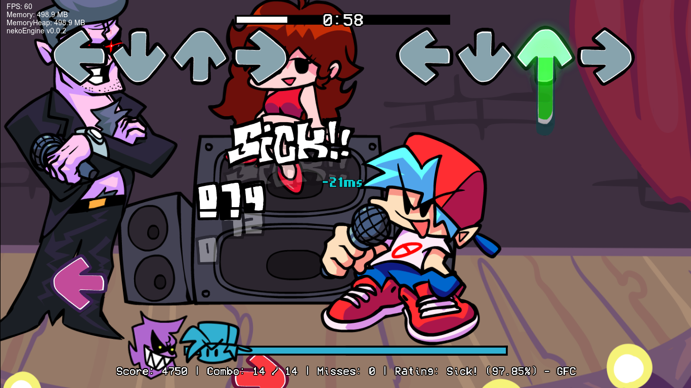

[English version](README.md)  

※このドキュメントはDeepL翻訳を使用しており、文章が正しくない場合があります。  
(日本語->英語->日本語)  
一応修正していますが、分かりづらい点がありましたらIssuesまでどうぞ。
  
[PsychEngineドキュメント](PsychEngine.md)
# Friday Night Funkin - nekoEngine
リンク: [Gamebanana](https://gamebanana.com/mods/406751) | [html5版](https://www.nennneko5787.ml/FNF-nekoEngine)  
Kade Engine、Psych Engine、Leather Engineの良いところだけを集めたMOD(?)。 
このMODはPsych Engineのフォークです。

## nekoEngineをビルド
[Haxeの最新版](https://haxe.org/download/)が必要です。4.1.5を使うのはやめてください、いくつかのものが欠けています。 

nekoEngine をビルドするには、プロンプト/ターミナル/PowerShell で以下のコマンドを実行します。 
<pre>
haxelib install lime
haxelib install openfl
haxelib install flixel
haxelib install flixel-addons
hxelib install flixel-ui
haxelib install hscript
haxelib install newgrounds
haxelib run lime setup
haxelib install flixel-tools
haxelib run flixel-tools setup
haxelib git polymod https://github.com/larsiusprime/polymod.git
haxelib git discord_rpc https://github.com/Aidan63/linc_discord-rpc
haxelib git linc_luajit https://github.com/nebulazorua/linc_luajit
haxelib install hxCodec
haxelib install hxcpp
</pre>
現時点では、カメラをズームアウトした曲のトランジションバグは、オプションで修正できます。
<pre>
haxelib git flixel-addons https://github.com/HaxeFlixel/flixel-addons
</pre>
これらをすべてインストールしたら、プロジェクトのルートフォルダで以下のコマンドを使用してビルドします。
### Windows
Windows版をビルドするには、[Visual Studio 2019のインストーラー](https://download.visualstudio.microsoft.com/download/pr/3105fcfe-e771-41d6-9a1c-fc971e7d03a7/8eb13958dc429a6e6f7e0d6704d43a55f18d02a253608351b6bf6723ffdaf24e/vs_Community.exe)をダウンロードし、インストーラーを実行し、個々のコンポーネントタブに移動し、以下の項目を選択します。

* MSVC v142 - VS 2019 C++ x64/x86 ビルドツール
* Windows SDK (10.0.17763.0)

<pre>
lime build windows
</pre>を実行します。
リリース版をビルドする場合は、以下のコマンドを使用します。
<pre>
lime build windows -release
</pre>
32ビット版をビルドする場合は、コマンドに以下の引数を追加します。
<pre>
-32 -D 32bits
</pre>
### Mac
<pre>
ライムビルドマック
</pre>
リリース版をビルドする場合は、以下のコマンドを使用します。
<pre>
lime build mac -release
</pre>
### Linux
LinuxでnekoEngineを動かすには、luajitとOpenALがインストールされている必要があります。 
以下、私の方法を説明します。
<pre>
git clone https://luajit.org/git/luajit.git
cd luajit
sudo make install
make
make install
export LD_LIBRARY_PATH=/usr/local/lib:$LD_LIBRARY_PATH 
sudo apt-get install libopenal-dev
sudo apt-get install libalut-dev
sudo apt-get install libalut0
sudo apt-get install oss-compat
</pre>
<pre>
lime build linux
</pre>
リリース版をビルドする場合は、以下のコマンドを使用します。
<pre>
lime build linux -release
</pre>
### HTML
<pre>
lime test html5 -release
</pre>
## 主な機能
Psych Engineの全機能と、以下の一部の機能を利用できます。
* 音符がヒットしたときのタイミング表示(ミリ秒単位)
</img>

* フリープレイメニューでの曲の自動再生(設定で有効にする必要があります)
* 日本語のサポート
</img>

* Psych Engine modsのサポート
## 今後追加される(予定の)機能
* 1~21キー表記に対応するよう修正。
* 相手のノートを叩けるようにする